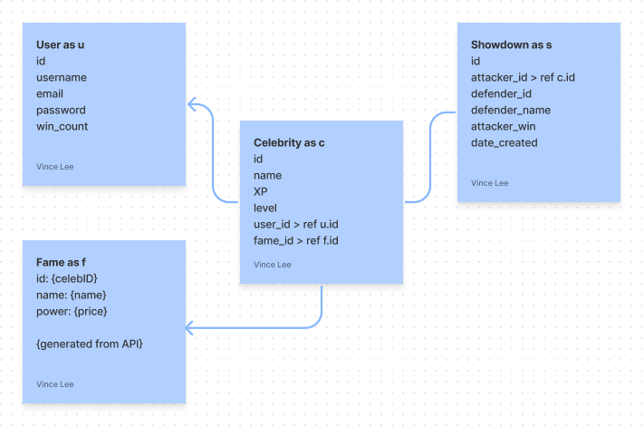
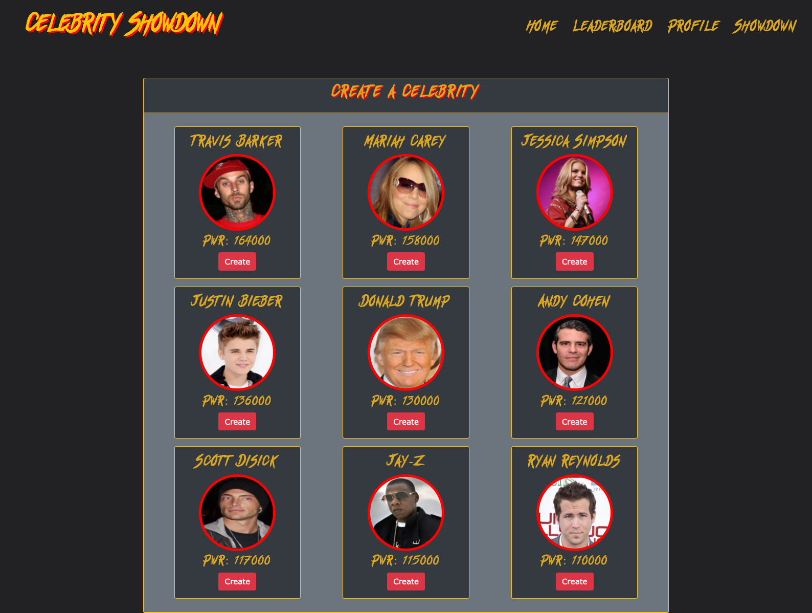
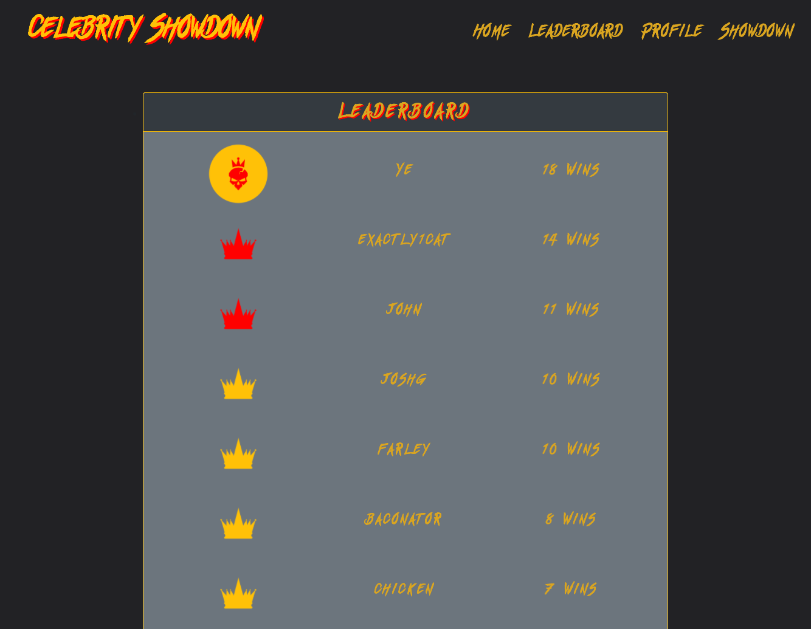

# Celebrity Showdown
This full-stack project is a website that takes in real-time celebrity data and simulates a fight between two celebrities. Celebrity fight stats and attributes are constantly updated and calculated based on their current popularity and fame. The user is able to create an account, add celebrities to their roster, and gain XP from fights to level-up their celebrity cards. This project was made using Nodejs, Express. Javascript, MySQL, and more. 

## Summary
Celebrity Showdown application is deployed to [Heroku here](https://powerful-badlands-23075.herokuapp.com/).

* Users create accounts to store their celebrity rosters, participate in showdowns, gain experience, and acheivements.
* Access to features and functionality is restricted by whether or now a user is authenticated or unauthenticated.
  * No authentication required: Homepage, Leaderboard, Login (+Signup)
  * Authentication required: User Profile, Showdowns, Celebrity Management
* A dynamic history of showdowns is avialable in the Homepage of the app
* The Leaderboard page offers the top 10 users in the game, ranked by the amount of matches won.
* Showdowns are the main gameplay of the application, accessible in the Showdowns page.
  * User selects a celebrity from their roster of celebrities to fight against a another Celebrity opponent. This opponent and their power stats are visible on the page so user can make strategic choice of which celebrity to choose from their roster.
  * Active fighting is visible to the user through celebrity animation and sound effects that correspond to each attack type.
  * Includes audio cues for win or loss at the end of each map. 
  * Showdown wins increment the winning user's win count, visible in their Profile page and used for Leaderboard generation.
  * Attacks are predicated on a celebrity's power stat, with level and XP modifiers on top enhancing strength of attack.
* Users are able to track win count and manage their celebrity roster from their profile page.
* Management of a celebrity roster includes addition and removal of celebrities.
  * User can delete any celebrity currently in their roster. The celebrity is removed from their roster and all celebrity experience (level, XP) is lost.
  * User can add a celebrity from the Profile page at any point. They are presented with 10 celebrities to choose from, with varying power levels. Celebrity options are refreshed every 30 minutes, so their option pool remains fresh.
* Celebrities available for addition to roster are generated from the CelebrityBucks API vis a vis the celebshowdown_db.fame table. 
  * The Celebrity Bucks api aggregates data scraped from leading celebrity news sites and social media platform, assigning dollar values to every mention and allowing for an price assignment on each celebrity based on their "popularity". Celebrities get their power from their popularity, so does Celebrity Showdown game logic.
  * The fame table is freshed every 30 minutes from the api, reflected in power changes for Celebrities in the game and potentially a change in which Celebrities are available to be added to a roster.
* This is a mobile first application and it is responsive to a most device sizes.

[Core app user flow video: Homepage to Profile, to Showdown, to Leaderboard, to Homepage](https://watch.screencastify.com/v/cLqQBs9CD7EMGWVuvCjO)

### Database Schema

### Homepage

### User Profile

### Showdowns

### Celebrity Management

### Add a Celebrity to a Roster

### Leaderboards

## Installation
Ensure you have Node.js installed locally to install packages to and from the public npm registry. Node.js installation documentation.

1. Clone the repository to your local machine.

2. Install application dependencies `npm install`.
Required when when you first set up the project for local development or use OR if any changes are made to the project's dependencies. More Node information here.

2. Update the `.env` file as needed for access, or create a `.env.local` for this purpose and add it to the .gitignore.

3. Set up your database mysql shell from the db folder in your terminal with `mysql -u root -p` Steps 2-4 need to be repeated after after any changes to your database or database modules.

4. `source schema.sql` to use the updated schema.

5. `quit` to exit your mysql shell.

6. From the root folder, add the seed data to your now established database with `npm run seed`

7. Start the application with `npm start` 

8. Open the website in local browser at http://localhost:3001

## Future Development Ideas
* Support User to User showdowns
* Support users initiating a showdown directly with specified user
* Multiple instances of a given celebrity in a roster
* Editable user Profile page, including setting celebrity image as profile picture
* Showdown start from user Profile page
* Ability to see other users' Profile pages
* User acheivement framework to encourage user longevity

## Technologies Used
* [Node](https://nodejs.org/en/) - Asynchronous event-driven JavaScript runtime environment that executes JavaScript code outside a web browser
* [NPM](https://www.npmjs.com/) - Node package manager, used in conjunction with JS and Inquirer to support application logic and Command Line interface.
  * [Axios](https://www.npmjs.com/package/axios) - Used for api request to CelebrityBucks
  * [MySQL2](https://www.npmjs.com/package/mysql2) - MySQL client to connect to a MySQL database for app Models.
  * [Sequelizejs](https://sequelize.org/) -  Promise-based Node.js ORM for Postgres, MySQL, MariaDB, SQLite and Microsoft SQL Server. Used for database creation and management via Models abstraction of database tables.
  * [Expressjs](https://expressjs.com/) - Leveraged for API's, utility methods, and middleware.
  * [Express Handlebars](https://www.npmjs.com/package/express-handlebars) - Used for page Views (app content templates).
  * [Express Session](https://www.npmjs.com/package/express-session) - Used for session authentication and managing cookies.
  * [Connect Session Sequelize](https://www.npmjs.com/package/connect-session-sequelize) - Used for session authentication.
  * [Dotenv](https://www.npmjs.com/package/dotenv) - Module for managing environmental variables.
  * [Bcrypt](https://www.npmjs.com/package/bcrypt) - Used for password hashing.
* [Bootstrap](https://getbootstrap.com/docs/5.0/getting-started/introduction/) - Style and icon framework.
* [CSS](https://devdocs.io/css/) - Custom application styling.
* [Javascript](https://developer.mozilla.org/en-US/docs/Web/javascript) - Core app logic
* [JQuery](https://code.jquery.com/) - Used to switch element classes by window size.
* [Animate CSS](https://animate.style/) - Used for animating elements in Showdown UI.

* [Figma](https://www.figma.com/files/recent?fuid=1021540689586237609) - Used as a collaborative tool to map database schema, models, & relationships definition; page content & authentication state definition; game logic definition.
* [Git](https://git-scm.com/doc) - Version control system to track changes to source code
* [GitHub](https://docs.github.com/en) - Hosts the code repository

## Authors
|**Gabriel Crosetti** | **Vince Lee** | **Sarah Hollingsworth** |
|-----------------|---------------|------------------|
| - [Portfolio](https://gabrielcrosetti.github.io/my-portfolio/)| - [Portfolio](https://starryblue7.github.io/portfolio/)| - [Portfolio](https://sahhollingsworth.github.io/sarah-hollingsworth-portfolio_advanced-css/) |
| - [Github](https://github.com/gabrielcrosetti)| - [Github](https://github.com/StarryBlue7) | - [Github](https://github.com/sahhollingsworth) |
| - [LinkedIn](https://www.linkedin.com/in/gabriel-crosetti/)| - [LinkedIn](https://www.linkedin.com/in/vince-lee/) | - [LinkedIn](https://www.linkedin.com/in/sarahhollingsworth/)|

## Acknowledgements
* Celebrity names, stats, and images generated from the [Celebrity Bucks API](https://rapidapi.com/brianiswu/api/celebrity-bucks/details)
* Reset.css in public domain, found at [Meyer Web](http://meyerweb.com/eric/tools/css/reset/)

## License
* MIT License (https://vince-lee.mit-license.org/)
